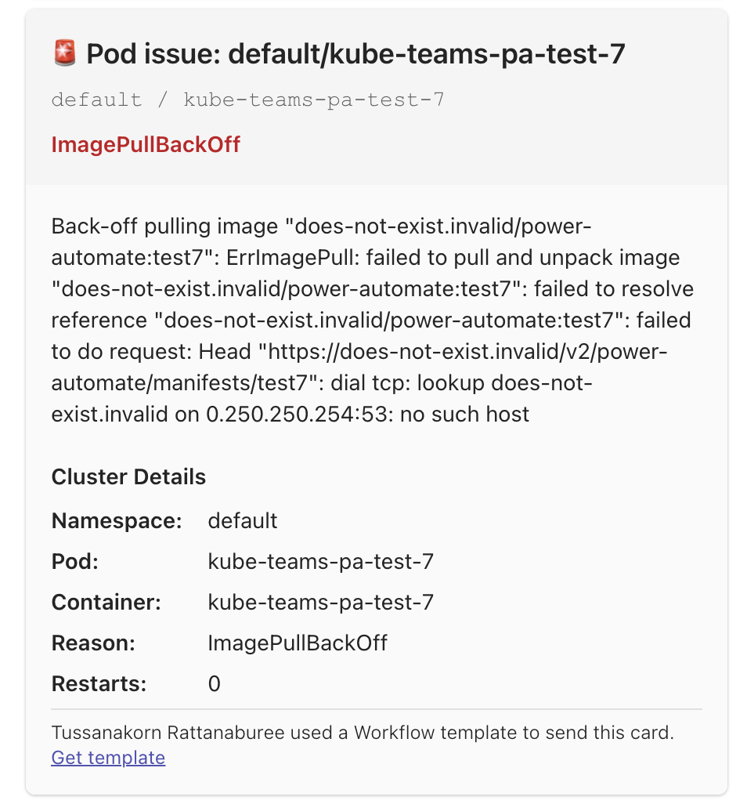

# kube-pod-alerts

`kube-pod-alerts` watches Kubernetes pods in real time and sends Microsoft Teams alerts when workloads fail.

It is built in Python, uses the Kubernetes Python client, supports in-cluster or kubeconfig auth, and is designed to be deployed as a standalone monitor per cluster.



## Detects

- Pod phase `Failed`
- Container waiting reason `CrashLoopBackOff`
- Container waiting reason `ImagePullBackOff`

## Features

- real-time pod watching with automatic reconnects
- duplicate alert suppression with a flood-expire window
- optional recovery notifications
- namespace scoping
- pod ignore annotations

## Payloads

Default mode is `power_automate`. The request body includes simple fields for flow mapping and an Adaptive Card attachment for Teams posting:

```json
{
  "title": "Pod issue: default/example",
  "text": "Back-off pulling image ...",
  "summary": "ImagePullBackOff",
  "reason": "ImagePullBackOff",
  "color": "E81123",
  "facts": {
    "Namespace": "default",
    "Pod": "example",
    "Container": "example"
  },
  "attachments": [
    {
      "contentType": "application/vnd.microsoft.card.adaptive",
      "content": {
        "type": "AdaptiveCard"
      }
    }
  ]
}
```

## Ignore annotations

- `kube-teams/ignore-pod`
- `kube-slack/ignore-pod`

Any truthy value such as `true`, `1`, or `yes` will suppress alerts for that pod.

## Environment variables

- `TEAMS_WEBHOOK_URL`: required. Power Automate or Teams webhook URL.
- `WEBHOOK_FORMAT`: optional. Default `power_automate`. Use `teams_message_card` only for classic Teams incoming webhooks.
- `KUBE_USE_CLUSTER` optional. Defaults to `true`. Use in-cluster authentication.
- `KUBE_USE_KUBECONFIG` optional. Defaults to `false`. Load credentials from kubeconfig instead.
- `KUBECONFIG` optional. Path to kubeconfig file.
- `KUBE_CONTEXT` optional. Explicit kubeconfig context name.
- `KUBE_NAMESPACES_ONLY` optional. Either a JSON array or comma-separated namespace list.
- `FLOOD_EXPIRE` optional. Defaults to `60000`. Deduplication window in milliseconds.
- `RECOVERY_ALERT` optional. Defaults to `true`. Send recovery notifications when failures clear.
- `WATCH_TIMEOUT_SECONDS` optional. Defaults to `300`. Watch stream timeout before reconnect.
- `LOG_LEVEL` optional. Defaults to `INFO`.

## Local run

```bash
python3 -m venv .venv
source .venv/bin/activate
pip install -r requirements.txt
export TEAMS_WEBHOOK_URL="https://outlook.office.com/webhook/replace-me"
export WEBHOOK_FORMAT=power_automate
export KUBE_USE_CLUSTER=false
export KUBE_USE_KUBECONFIG=true
python3 main.py
```

## Docker

```bash
docker build -t tussanakorndev/kube-pod-alerts:1.0.5 .
docker push tussanakorndev/kube-pod-alerts:1.0.5
```

GitHub Actions can publish the image automatically on pushes to `main`. Set these repository secrets first:

- `DOCKERHUB_USERNAME`
- `DOCKERHUB_TOKEN`

## Helm repository

This repo can publish its Helm chart to GitHub Pages as a Helm repository.

Expected repository URL:

```bash
https://tussanakorn.github.io/kube-pod-alerts
```

After GitHub Pages is enabled and the release workflow has run successfully, install with:

```bash
helm repo add kube-pod-alerts https://tussanakorn.github.io/kube-pod-alerts
helm repo update
helm search repo kube-pod-alerts
helm install kube-pod-alerts kube-pod-alerts/kube-pod-alerts -n monitoring --create-namespace
```

GitHub setup steps:

1. Create a `gh-pages` branch in the repository.
2. In GitHub `Settings -> Pages`, set the source branch to `gh-pages`.
3. Push a chart version bump in `charts/kube-pod-alerts/Chart.yaml` to trigger `.github/workflows/release-charts.yml`.
4. Add `https://tussanakorn.github.io/kube-pod-alerts` as a Helm repository in Artifact Hub.

Artifact Hub note:

`artifacthub-repo.yml` is included in this repo, but for Verified Publisher setup it must also be available at the root of the published GitHub Pages site.

## Production deploy

Recommended setup:

1. Build and push the image.
2. Deploy the monitor as a standalone Helm release.
3. Manage that Helm release with a separate Argo CD `Application`.

The standalone chart is at [charts/kube-pod-alerts](/Users/tussanakorn.rat/Pantavanij/02-SourceCode/kube-slack/charts/kube-pod-alerts).

Example `values-prod.yaml`:

```yaml
image:
  repository: tussanakorndev/kube-pod-alerts
  tag: 1.0.5

env:
  WEBHOOK_FORMAT: power_automate
  KUBE_USE_CLUSTER: "true"
  RECOVERY_ALERT: "true"
  FLOOD_EXPIRE: "60000"
  KUBE_NAMESPACES_ONLY: '["default","prod"]'

secretEnv:
  TEAMS_WEBHOOK_URL: "https://example.webhook"
```

Install with Helm:

```bash
helm upgrade --install kube-pod-alerts ./charts/kube-pod-alerts -n monitoring --create-namespace -f values-prod.yaml
```

## Argo CD

Keep your service charts unchanged. Deploy this monitor as a separate Argo CD `Application` per cluster.

Example Argo CD `Application`:

```yaml
apiVersion: argoproj.io/v1alpha1
kind: Application
metadata:
  name: kube-pod-alerts
  namespace: argocd
spec:
  project: default
  destination:
    server: https://kubernetes.default.svc
    namespace: monitoring
  source:
    repoURL: https://github.com/your-org/your-repo.git
    targetRevision: main
    path: charts/kube-pod-alerts
    helm:
      valueFiles:
        - values-prod.yaml
  syncPolicy:
    automated:
      prune: true
      selfHeal: true
    syncOptions:
      - CreateNamespace=true
```

Recommended production pattern:

- One monitor deployment per cluster.
- Use cluster-specific values files such as `values-dev.yaml`, `values-staging.yaml`, and `values-prod.yaml`.
- Scope `KUBE_NAMESPACES_ONLY` when each environment or team should alert separately.
- Store `TEAMS_WEBHOOK_URL` in a sealed secret, external secret, or private values source in GitOps.

## Legacy manifest

If you need a plain manifest instead of Helm, a sample file is still available at [deploy/kube-pod-alerts.yaml](/Users/tussanakorn.rat/Pantavanij/02-SourceCode/kube-slack/deploy/kube-pod-alerts.yaml).

## Project layout

- [main.py](/Users/tussanakorn.rat/Pantavanij/02-SourceCode/kube-slack/main.py) starts the service.
- [kube_pod_alerts/config.py](/Users/tussanakorn.rat/Pantavanij/02-SourceCode/kube-slack/kube_pod_alerts/config.py) loads environment configuration.
- [kube_pod_alerts/kube_client.py](/Users/tussanakorn.rat/Pantavanij/02-SourceCode/kube-slack/kube_pod_alerts/kube_client.py) initializes Kubernetes auth.
- [kube_pod_alerts/monitor.py](/Users/tussanakorn.rat/Pantavanij/02-SourceCode/kube-slack/kube_pod_alerts/monitor.py) watches pods and detects failures.
- [kube_pod_alerts/notifier.py](/Users/tussanakorn.rat/Pantavanij/02-SourceCode/kube-slack/kube_pod_alerts/notifier.py) posts to Microsoft Teams.
- [charts/kube-pod-alerts](/Users/tussanakorn.rat/Pantavanij/02-SourceCode/kube-slack/charts/kube-pod-alerts) contains the standalone Helm chart for production and Argo CD deployment.
